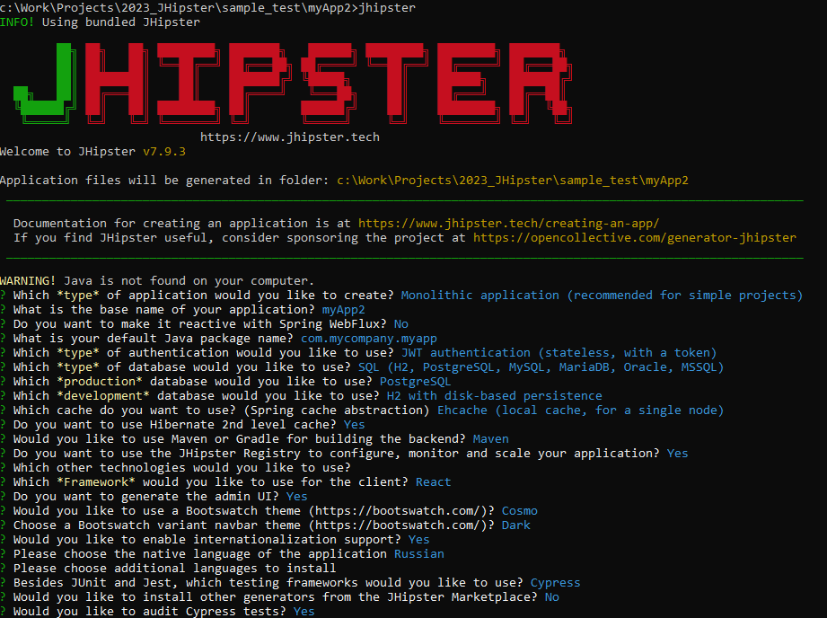

# Генерация примера JHipster

1. Устанавливаем Node.js [18.16.0](https://nodejs.org/dist/v18.16.0/node-v18.16.0-x64.msi)

Лучше воспользоваться утилитой nvm.

```
nvm install 18.16.0
```

2. Устанавливаем глобально генератор jhipster

```
npm install -g generator-jhipster
```

3. Переходим в папку где будет находится наш проект и запускаем генератор

```
jhipster
```

4. Указываем параметры проекта.

Например:


И ждем выполнения всех установок.

После этой генерации мы получаем базовый рабочий проект основу. Для дальнейшего добавления или изменения компонентов будет происходить путем догенерации.

5. Поднимаем докер образ с БД PostgreeSQL

Порт: 5432
<br/>Пользователь: postgres
<br/>Пароль: postgres

6. Добавление тестовой структуры данных

Заходим на онлайн редактор JDL https://start.jhipster.tech/jdl-studio/

Скачиваем jdl под именем default sample (можно нарисовать свою тестовую структуру данных)

Вызываем команду 
```
jhipster jdl jhipster-jdl.jdl
```

Структуру данных можно неоднократно переделывать, достаточно после ее скачивания снова вызвать команду **jhipster jdl**.

7. Запускаем бекенд

```
mvnw
```

8. Запускаем фронтенд

```
npm start
```